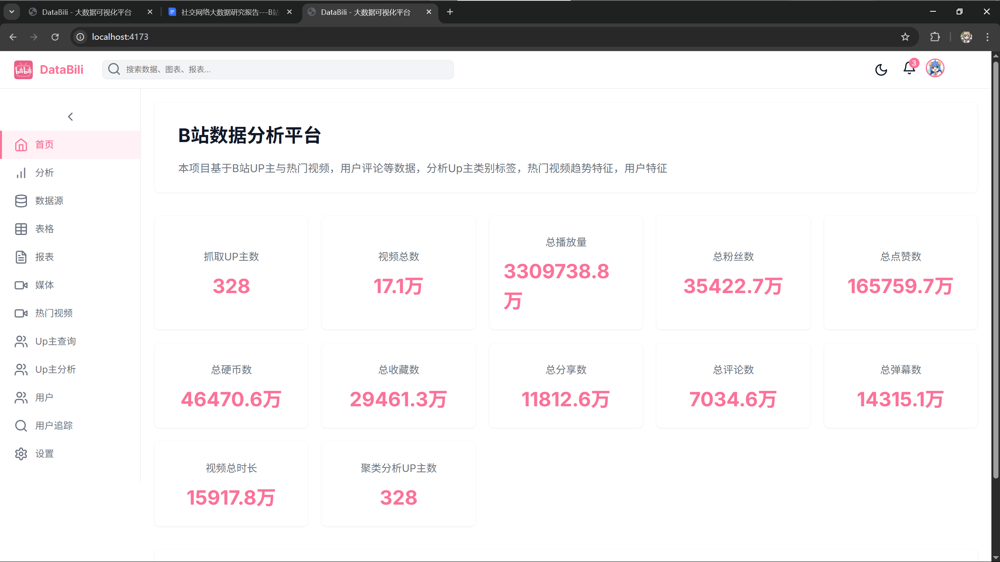
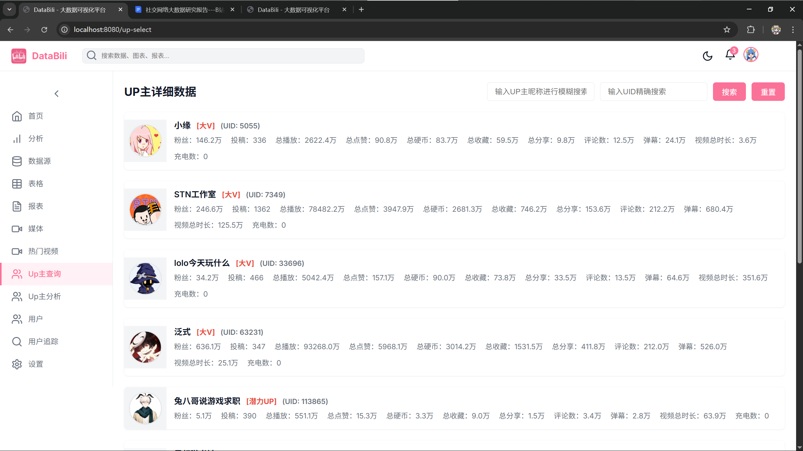
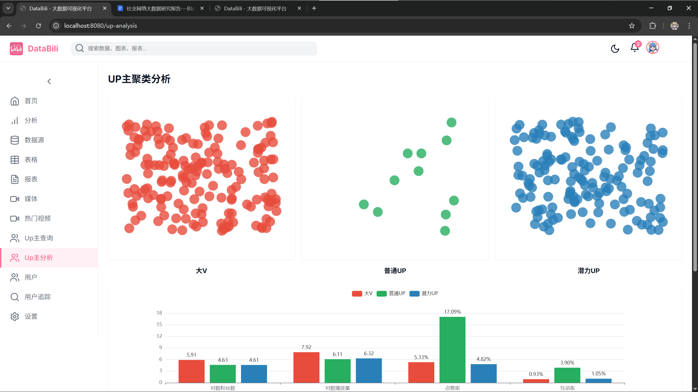
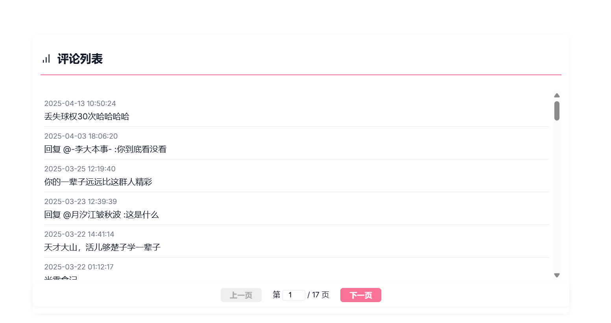

<div align="center">

# DataBili

**面向学习与研究的 B 站公开数据采集、分析与可视化平台。**


[功能概览](#功能概览) · [截图](#页面截图) · [快速开始](#快速开始) · [爬虫分级](#爬虫模块与风险分级) · [合规边界](#合规边界)

[English](README_EN.md)

</div>

DataBili 将 Python 异步采集、MySQL 数据存储、Express API、Vue 3 可视化和 UP 主聚类分析整合在一个本地学习项目中。它面向公开热门视频的趋势观察、每小时变化量记录、UP 主资料展示与聚类分析；不提供绕过平台访问控制的能力。

> 本项目仅用于学习、研究和本地实验。使用前请遵守 B 站用户协议、robots 规则、第三方服务条款、数据主体权益和适用法律法规。

## 功能概览

| 模块 | 能力 |
| --- | --- |
| 热门视频数据 | 采集公开热门视频，存储标题、分区、作者、标签与互动统计。 |
| 变化量分析 | 按小时保存热门视频快照，展示播放、互动和在线人数趋势。 |
| UP 主分析 | 查询已入库的 UP 主资料，基于已有数据展示聚类结果。 |
| 项目已观测视频 | 在投稿列表受限时，返回项目自身热门数据中已观察到的视频，不将其伪装为完整投稿列表。 |
| 用户行为分析 | 后端提供用户追踪与评论分析接口，前端提供对应页面入口。 |
| 大模型集成 | 前端“系统设置 -> 集成设置”支持运行时配置 OpenAI-compatible 服务。 |

## 系统架构

```text
┌─────────────────────────────────────────────────────────────────────┐
│ Vue 3 + Vite 前端                                                    │
│ 概览 · 热门视频 · UP 主查询 · 聚类分析 · 用户追踪 · 系统设置        │
└───────────────────────────────┬─────────────────────────────────────┘
                                │ HTTP / JSON
                                ▼
┌─────────────────────────────────────────────────────────────────────┐
│ Express API                                                          │
│ 热门数据 · UP 主资料 · 已观测视频 · 用户追踪 · LLM 运行时配置       │
└───────────────┬───────────────────────────────────────┬─────────────┘
                │                                       │
                ▼                                       ▼
┌─────────────────────────────┐           ┌───────────────────────────┐
│ MySQL 8                     │           │ OpenAI-compatible 服务    │
│ 热门视频快照 · UP 主资料    │           │ 用户在前端自行配置        │
└──────────────┬──────────────┘           └───────────────────────────┘
               ▲
               │ 低频、受控请求；异常即停止
┌──────────────┴──────────────────────────────────────────────────────┐
│ Python 数据采集                                                      │
│ 热门视频 · 每小时变化量 · UP 主资料与合规降级                        │
└─────────────────────────────────────────────────────────────────────┘
```

## 仓库结构

| 目录 | 说明 |
| --- | --- |
| [`frontend/`](frontend) | Vue 3 + Vite 前端页面与图表。 |
| [`backend/`](backend) | Express API、MySQL 访问、代理和运行时大模型配置。 |
| [`dataCrawler/`](dataCrawler) | Python 异步热门数据、变化量和 UP 主采集脚本。 |
| [`upModel/`](upModel) | UP 主数据处理、聚类与预测脚本。 |
| [`docs/`](docs) | 研究报告、运行截图、验证记录和免责声明。 |

## 页面截图

以下页面截图来自项目研究报告中的历史运行记录，仅用于展示界面和功能，不代表当前数据状态。

| 平台概览 | UP 主查询 |
| --- | --- |
|  |  |

| UP 主聚类分析 | 热门视频 |
| --- | --- |
|  |  |

| 在线人数趋势 | 标签词云 |
| --- | --- |
|  |  |

## 快速开始

### 环境要求

- Node.js 18+
- Python 3.10+
- MySQL 8+

### 1. 配置环境变量

复制根目录 `.env.example` 为 `.env`，再填写本地 MySQL 配置：

```dotenv
PORT=3000

DB_HOST=localhost
DB_PORT=3306
DB_USER=root
DB_PASSWORD=your-password
DB_NAME=databili

BILI_USE_CREDENTIAL=false
BILI_SESSDATA=
BILI_BILI_JCT=
BILI_PROXY_URL=
```

`.env` 已被 Git 忽略。不要提交数据库密码、Cookie、API Key 或个人数据。

### 2. 导入数据库

使用 MySQL 导入根目录的初始化 SQL：

```powershell
mysql -u root -p databili < databili_max.sql
```

### 3. 启动后端

```powershell
Set-Location backend
npm install
npm start
```

后端默认监听 `http://localhost:3000`。

### 4. 启动前端

另开一个终端：

```powershell
Set-Location frontend
npm install
npm run dev
```

打开 `http://localhost:8080`。Vite 已将 `/api` 与 `/proxy` 转发至 `http://localhost:3000`。

### 5. 安装采集依赖与健康检查

```powershell
Set-Location dataCrawler
python -m pip install -r requirements.txt
python healthcheck.py --timeout 10
```

健康检查只访问公开热门接口。HTTP 403、412、429 或非零风控 API code 会使当前请求停止，不执行绕过。

## 爬虫模块与风险分级

分级表示当前实现的访问控制敏感度与运行约束，不是对平台长期可用性的保证。所有任务都应低频运行、记录状态并遵守平台规则。

| 模块 | 入口 | 分级 | 已验证行为与使用限制 |
| --- | --- | --- | --- |
| 热门视频 | `dataCrawler/fetch_hot.py` | 低 | 访问公开热门数据。受控低频测试已通过；返回异常状态时停止当前请求。 |
| 热门视频变化量 | `dataCrawler/real_time_people_nums/fetch_hot_server.py` | 中 | 每小时保存热门视频快照、标签与实时人数。标签请求可能收到 HTTP 412；对应请求会停止。 |
| UP 主基础资料 | `dataCrawler/fetch_up.py` | 中 | 无授权环境可获得部分基础资料与粉丝数；仍应控制频率。 |
| UP 主投稿与视频统计 | `dataCrawler/fetch_up.py` | 高 | 当前环境实测投稿列表可收到 HTTP 412。程序保留已确认基础资料，写入 `risk_blocked` 与冷却时间，不写入伪造的零统计。 |
| 已观测视频降级数据 | `GET /api/up-profile/known-videos?uid=<UID>` | 低 | 仅读取本项目 `bilibili_hot_videos_server` 中已有记录，不请求投稿列表，且不等同完整投稿数据。 |

### 热门视频与每小时变化量

单轮采集示例：

```powershell
Set-Location dataCrawler/real_time_people_nums
python fetch_hot_server.py --items 5
```

持续采集示例：

```powershell
python fetch_hot_server.py --loop --items 500 --interval 3600
```

仅需生成 JSON 而不写数据库时：

```powershell
Set-Location dataCrawler
$env:CRAWLER_SKIP_DB='true'
python fetch_hot.py
```

### UP 主数据

`fetch_up.py` 读取 UID 文件并写入 `up_profile`。当投稿列表触发 HTTP 412 时，系统不会无限重试或规避风控；它会保存可获得的基础资料，记录状态，并在冷却期内跳过再次请求。

完整调研与状态说明见 [`docs/up主数据爬取接口调研文档.md`](docs/up主数据爬取接口调研文档.md)。

## 大模型配置

在前端进入“系统设置 -> 集成设置”，填写服务名称、Base URL、模型名称和 API Key，可接入任意 OpenAI-compatible 服务。

- 配置在浏览器本地保存，并以运行时配置提交到本地后端。
- 读取 `GET /api/llm-config` 不会返回 API Key。
- 不要把大模型 API Key 写入 `.env` 或提交到仓库。

## 验证

发布前验证记录见 [`docs/VERIFICATION.md`](docs/VERIFICATION.md)，包括 Python 语法、公开接口健康检查、爬虫测试、前端构建、Node.js 语法、MySQL 连接与大模型配置接口验证。

其中，受控稳定性复验在共享 HTTP 会话下连续执行热门列表、标签和实时人数请求三轮；该结果只证明低频、小样本条件下的完整链路，不构成长期或大规模采集保证。

## 合规边界

DataBili 不提供也不鼓励以下行为：

- 共享、购买或使用来源不明的 Cookie 与账号。
- 通过代理轮换规避频率限制或风控。
- 伪造设备指纹、规避验证码、规避登录限制、规避封禁或其他访问控制。
- 提交未经授权的抓取结果、个人数据、数据库密码或 API Key。

详细责任与使用边界见 [`docs/DISCLAIMER.md`](docs/DISCLAIMER.md)。

## 贡献

1. 从 `main` 创建聚焦功能分支。
2. 修改行为时补充相关测试和文档。
3. 提交前执行 `git diff --check`，并运行受影响的 Python、Node.js 或前端验证。
4. 不提交 `.env`、Cookie、API Key、日志、`node_modules/`、缓存或未经授权的数据。

## 许可证

DataBili 使用 [MIT License](LICENSE) 开源。MIT 许可证不免除使用者遵守平台规则、服务条款与适用法律的责任。
